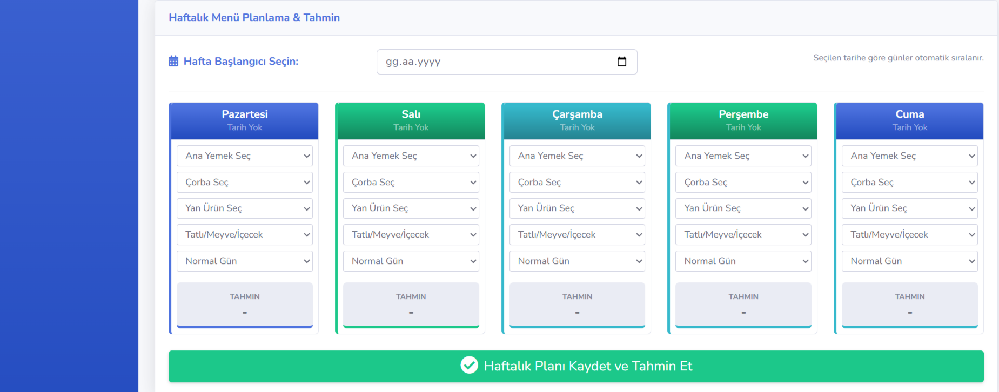
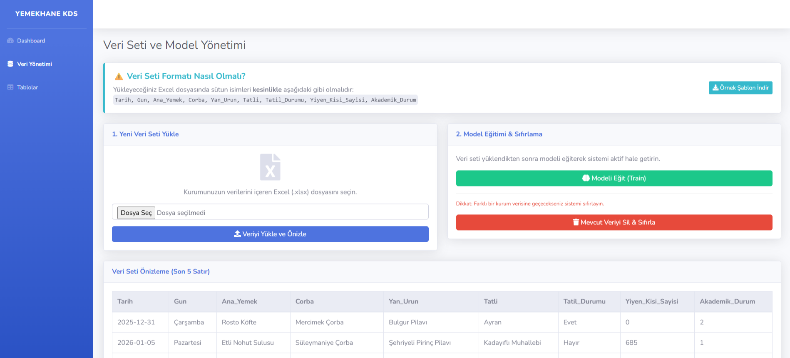
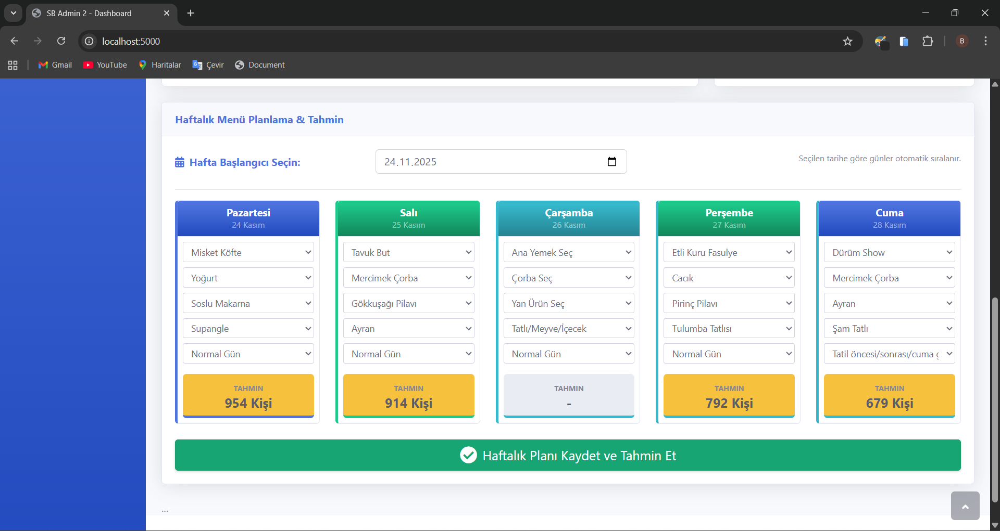

# Yemekhane-Talep-Tahmin-Sistemi
Üniversite yemekhanelerine yönelik yapay zeka destekli talep tahmin sistemi

**ÖZET**

Üniversite yemekhanelerinde günlük yemek üretim miktarının doğru tahmin edilememesi, ya aşırı üretim sonucu gıda israfına ya da eksik üretim sonucu öğrencilerin mağduriyetine yol açmaktadır.
Bu çalışmada, Gaziantep İslam Bilim ve Teknoloji Üniversitesi yemekhane verileri kullanılarak, yapay zeka tabanlı bir karar destek sistemi geliştirilmiştir. Çalışmada, kategorik verilerle yüksek başarı sağlayan Random Forest Regressor algoritması kullanılmıştır. Modelin tahmin başarısını artırmak amacıyla veri setine "Akademik Durum" (sınav haftası, tatil öncesi vb.) parametresi eklenerek öznitelik mühendisliği uygulanmış ve bu işlem sonucunda Ortalama Mutlak Hata (MAE) değeri düşürülmüştür. Geliştirilen web tabanlı arayüz ile yöneticilerin geçmiş verileri analiz etmesi ve gelecek menüler için yüksek doğrulukla tahminleme yapması sağlanmıştır

**2. MATERYAL VE YÖNTEM**
**2.1. Veri Seti ve Özellikleri**
Çalışmada Gaziantep İslam Bilim ve Teknoloji Üniversitesi yemekhanesine ait 90 günlük gerçek veriler kullanılmıştır. Veri seti; öğrencilerin ve personelin yemek yeme alışkanlıklarını yansıtan tarihsel kayıtlardan oluşmaktadır. Ham veri seti şu temel öznitelikleri içermektedir: Tarih, Haftanın Günü, Ana Yemek, Çorba, Yan Ürün, Tatlı/Meyve ve hedef değişken (target) olan Yiyen Kişi Sayısı. 90 günlük süre, bir akademik dönemin büyük bir kısmını kapsadığı için modelin hem normal günleri hem de sınav/tatil dönemlerini öğrenmesi açısından yeterli çeşitliliği sağlamaktadır.

**2.2. Veri Ön İşleme ve Sayısallaştırma (Label Encoding)**
Makine öğrenmesi algoritmaları, metin tabanlı verilerle (String) doğrudan matematiksel işlem yapamazlar. Bu çalışmada kullanılan veri setindeki "Karnıyarık", "Pilav", "Mercimek Çorbası" gibi kategorik verilerin modele girdi olarak verilebilmesi için sayısallaştırılması gerekmektedir. Bu amaçla Label Encoding tekniği kullanılmıştır.
Bu teknikte, veri setindeki her bir benzersiz yemek ismine alfabetik sıraya göre bir tamsayı atanmıştır (Örn: Adana Kebap=1, Taze Fasulye=22). Böylece sözel ifadeler, regresyon modelinin işleyebileceği matematiksel matrislere dönüştürülmüştür.

**2.3. Öznitelik Mühendisliği (Feature Engineering): Akademik Durum**
Modelin ilk eğitim aşamasında MAE (Ortalama Mutlak Hata) değerinin yüksek çıkması üzerine, yemek yeme davranışını etkileyen gizli faktörler analiz edilmiştir. Üniversite öğrencilerinin Cuma günleri memleketlerine gitmeleri veya sınav haftalarında kampüste daha fazla vakit geçirmeleri gibi durumların, sadece "Tarih" verisiyle açıklanamadığı görülmüştür.
Bu problemi çözmek ve modelin tahmin yeteneğini artırmak amacıyla veri setine "Akademik Durum" adında yeni bir öznitelik eklenmiştir. Bu sütun, yemekhane takvimi ve akademik takvim incelenerek şu mantıkla kodlanmıştır:
•	0 (Normal Gün): Standart eğitim günleri.
•	1 (Sınav Haftası): Vize ve final haftaları (Kampüs yoğunluğunun arttığı dönemler).
•	2 (Tatil Etkisi): Resmi tatil öncesi günler ve Cuma günleri (Öğrenci sayısının belirgin şekilde düştüğü dönemler).
Bu yeni öznitelik sayesinde model, sadece yemeğin türüne göre değil, o günün akademik niteliğine göre de kişi sayısının artıp azalacağını öğrenmiştir.

**2.4. Algoritma Seçimi: Random Forest Regressor**
Bu çalışmada tahminleme algoritması olarak Random Forest Regressor (Rastgele Orman Regresyonu) seçilmiştir. Bu seçimin temel nedenleri şunlardır:
  1.	Kategorik Veri Başarısı: Random Forest, yemek türleri gibi kategorik verilerle ve doğrusal olmayan ilişkilerle (Non-linear) çalışmakta diğer algoritmalara (Linear Regression vb.) göre daha başarılıdır.
  2.	Overfitting (Aşırı Öğrenme) Kontrolü: Tek bir karar ağacı (Decision Tree) kullanıldığında, model veriyi ezberlemeye meyillidir. Random Forest ise yüzlerce karar ağacı oluşturur ve bu ağaçların sonuçlarının     ortalamasını alır. Bu "Topluluk Öğrenme" (Ensemble Learning) yöntemi, modelin daha genel geçer ve tutarlı tahminler yapmasını sağlar.
  3.	Parametreler: Çalışmada ağaç sayısı (n_estimators) 100 olarak belirlenmiştir. Bu, modelin her tahmin için arka planda 100 farklı senaryo çalıştırıp en optimum sonucu ürettiği anlamına gelir.
**2.5. Sistem Mimarisi**
Geliştirilen sistem, Python programlama dili ve Flask web çatısı (framework) kullanılarak web tabanlı bir uygulama haline getirilmiştir. Arayüzde, kullanıcıların geçmiş verilerden otomatik olarak çekilen yemekleri seçebileceği dinamik "Dropdown" menüler kullanılmıştır.

Şekil 1: Menü planlama ve tahminleme arayüzü.

Ayrıca sistem, kullanıcıların kendi Excel veri setlerini yükleyip modeli yeniden eğitebilecekleri esnek bir yapıya sahiptir.

Şekil 2: Veri seti yönetimi ve model eğitimi modülü.

**3. BULGULAR VE TARTIŞMA**
**3.1. Model Performansı**
Modelin başarısı, tahmin edilen sayı ile gerçek sayı arasındaki farkın mutlak değerlerinin ortalaması olan MAE (Mean Absolute Error) metriği ile ölçülmüştür.
 **•	İlk Aşama (Ham Veri):** Sadece tarih ve yemek bilgileriyle yapılan eğitim sonucunda MAE değeri 138 olarak hesaplanmıştır.
 **•	İkinci Aşama (Öznitelik Mühendisliği):** "Akademik Durum" sütunu eklendikten sonra yapılan eğitimde MAE değeri 118’e düşmüştür.
   Bu 20 birimlik iyileşme, üniversite yemekhanelerinde talebin sadece "ne yemek çıktığına" değil, "o günün akademik takvimdeki yerine" de sıkı sıkıya bağlı olduğunu kanıtlamaktadır.
**3.2. Senaryo Bazlı Doğrulama (Hold-out Validation)**
Sistemin güvenilirliğini test etmek amacıyla, veri setinden rastgele seçilen 2 haftalık veri silinmiş ve model geri kalan verilerle eğitilmiştir. Daha sonra silinen bu haftaların menüleri sisteme girilerek tahmin yaptırılmış ve gerçek sonuçlarla kıyaslanmıştır.
Yapılan testlerde, modelin genel trendi yakaladığı, ancak veri setinde daha önce hiç bulunmayan (unique) yeni bir yemek türü menüye eklendiğinde, sistemin bu yemeği tanıyamadığı için "Dropdown" listesinde gösteremediği (Soğuk Başlangıç / Cold Start sorunu) gözlemlenmiştir. Bu durum, veri seti büyüdükçe ve yemek çeşitliliği arttıkça kendiliğinden çözülecek bir kısıtlılıktır.

Şekil 3: Eğitim veri setinden 1 haftalık verinin çıkarılmasıyla elde edilen MAE değeri..

Şekil 4: Test için Çıkarılan 1 haftanın tahmin sonuçları .
